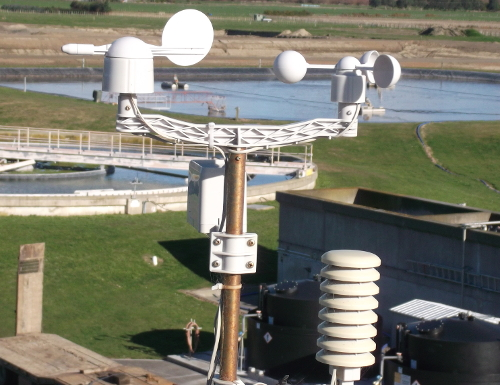
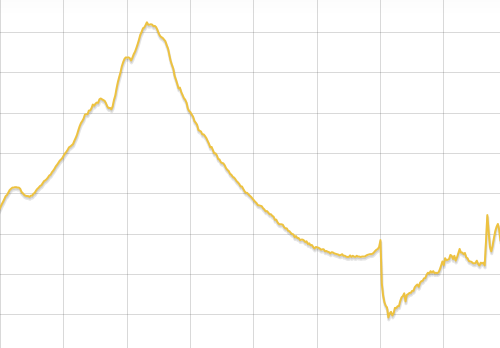

# Weather Station Scheme of Work

## Introduction
This scheme of work has been designed to be a cross curricular exploration of how we can predict the behaviour of our weather by measuring, collecting and anaylsing weather data. By the end of all the lessons, students will have built their own weather station using a Raspberry Pi, used it to collect data about the weather and created a webpage in order to display their findings. 

This scheme of work is specifically targeted towards KS3 and 4 Computing, although it could be taught in conjunction with Science, Geography and Numeracy lessons.

## Learning Outcomes
Over the course of these lessons, students will learn:
- How information about the weather is measured and collected
- How to build a weather recording device with a Raspberry Pi
- How to build a website to display collected weather data
- How to analyse weather data and make predictions about future weather

## Computing programme of Study Met 

**KS3**

**KS4**

[National Curriculum Computing Programmes of Study](https://www.gov.uk/government/publications/national-curriculum-in-england-computing-programmes-of-study/national-curriculum-in-england-computing-programmes-of-study#key-stage-3)

## Resources
For the majority of the lessons, it is suggested that work is carried out by students on a Raspberry Pi in pairs or small groups. Each group should have access to the standard equipment described below. In addition, it is suggested that you have your own teacher setup connected to a projector screen for demonstration purposes. Alternatively one Raspberry Pi could be used as part of a class project.

- A Raspberry Pi per group
- Latest NOOBS SD card with Raspbian
- A keyboard and mouse connected to the RPi per group
- A monitor connected to the RPi per group
- A micro USB power apdapter per group
- All necessary cables

## Lessons

### Collection

These lessons will cover how to use the Raspberry Pi and peripherals to build a fully working weather station capable of recording measurements from a variety of sensors. Students will learn how each sensor works and how to write python code to take readings from them.

Code will be written to log data from the sensors into a database stored on the Raspberry Pi SD card for later retrieval and display. If you wish your measurement data can be uploaded to an Oracle server on the Internet allowing it to be used in conjunction with data from other weather stations around the UK.

Finally the finished weather station will be deployed to an outdoor location, chosen in a scientific way, to ensure the reliability of the data. The weather station will be remotely accessible by the students allowing them to develop a website to display the their data in real time.

- [Lesson 1](lessons/collection/lesson1/README.md)
- [Lesson 2](lessons/collection/lesson2/README.md)
- [Lesson 3](lessons/collection/lesson3/README.md)

### Display

Students will learn how to create a website that will provide weather reports based on the data that they have collected. This website will show numerous graphs and graphical displays to the user and will continually update as new weather measurements are taken.

Students will also learn how to combine their data with that from other weather stations around the UK to produce a [Google Maps](https://maps.google.co.uk/) overlay to geographically display integrated weather maps.

- Lesson 1
- Lesson 2

### Interpretation

Students will learn how to discern patterns in weather data, analyse them and use them to inform predictions about future weather. This will be done for both local (using their own data) and national weather (using data from the Oracle server on the Internet).

Code will be written to computationally calculate a daily weather outlook which will be displayed on their wesbite.

- Lesson 1
- Lesson 2

## Licence

Unless otherwise specified, everything in this repository is covered by the following licence:

***Weather Station Scheme of Work*** by the [Raspberry Pi Foundation](http://raspberrypi.org) is licenced under a [Creative Commons Attribution 4.0 International License](http://creativecommons.org/licenses/by-sa/4.0/).

Based on a work at https://github.com/raspberrypilearning/weather-station-sow
