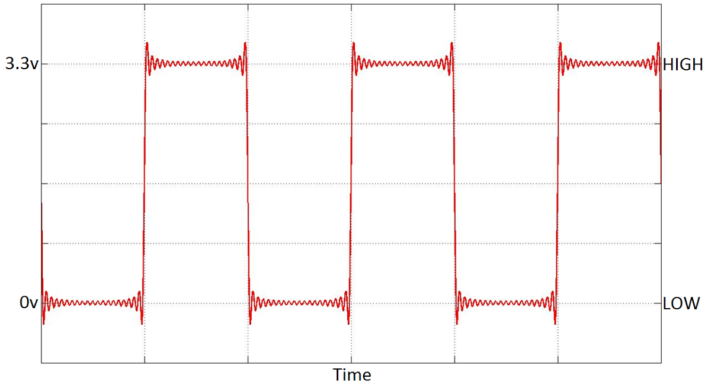

# Working with Sensors - Lesson Plan 1

This lesson will introduce the idea behind the weather station and why we need one to build one. It serves as a general introduction to the scheme of work and will prepare the students to give them a general overview of what they are aiming to achieve. It will also introduce the using a the Raspberry Pi GPIO pins to connect to measurement devices.

## Learning objectives

- To identify weather characteristics that can be measured
- To explain the need for an automated weather station
- To understand the potential uses for the Raspberry Pi GPIO interface
- To differentiate between the input and output modes of the GPIO interface
- Understand the meaning of HIGH and LOW in releation to digital hardware

## Learning outcomes

### All students are able to

- Understand why collecting data is essential to weather forecasting
- Suggest a property of the weather that could be measured
- Explain the difference between input and output

### Most students are able to

- Suggest appropriate methods or devices for capturing weather data
- Understand that digital devices only read and produces two states `HIGH` / `LOW`

### Some students are able to

- Relate `HIGH` / `LOW` to other digital representations (ON/OFF, 1/0)
- Describe how the sensors might work and be able to connect to `HIGH` / `LOW` signals.

## Lesson Summary

- Explore how weather data is collected and what measurements might be taken.
- What other data needs to be captured?
- What kind of computing device would be best for running this project?
- What are the differences between Input and Output mode, what does High & Low Mean?

## Starter

Predictions about future weather aren't useful unless they are based on scientifically gathered measurements. So what can we measure and how can we do it scientifically?

Get students to consider the different characteristics that could be collected, how these could be collected and what the measurement might be. This could be done through:
- general class discussion
- playing with the sensors and predicting what they might do
- a simple [cardsort](files/WeatherStationCardsort.pdf)

Discuss with the students other data we might want to store which isn't being captured by the sensors, bring them round to the idea that we will need the following.

Measurement | Reason
--- | ---
Date and Time | Links the measurement to a specific time allowing for comparison to other measurements taken at earlier or later times
Location | Ties the measurement to a specific place allowing for comparison to other measurements taken at different locations and for plotting on a map

## Main development

1. For this project we will be using a computer to gather the required data, ask the students to suggest reasons for this decision, what are the alternatives, advantages and disadvantages?

2. What kind of computer would be appropriate what are the criteria? Get the students to discuss?
  - Small size,  meaning that it can be setup in any location.
  - Low Power, we don't want to have to run mains power out to wherever the computer is.
  - Robust, the computer needs to work well outdoors and not cost the earth if it fails.
  - Collect Data, the computer needs to be able to communicate with sensors to gather the required data.

3. The [Raspberry Pi](http://www.raspberrypi.org/help/what-is-a-raspberry-pi/) offers a great solution to this problem and is what we'll use. At this point (especially if this is the students first time using the Raspberry Pi) it might be worthwhile reviewing the [getting started lesson](http://www.raspberrypi.org/learning/getting-started-with-raspberry-pi-lesson/).

  

  *The Raspberry Pi model B (left) and the B+ (right)*

4. What makes this computer different to the ones you may be used before is the row of pins, sticking up, in the corner.

    Those are called General Purpose Input Output pins or *GPIO* for short. These allow the Raspberry Pi to interface with a wide range of electronics and physical objects such as lights, buzzers, motors, robotic arms, servos, relays and sensors.

    Each individual pin can be set up in two main modes: *Input* mode and *Output* mode.

    ## Output mode

    Output mode is used when you want to supply power to a device like an LED or buzzer. The picture below shows how a single LED would be connected.

    

    The blue wire is able to switch the positive leg of the LED on/off. The black wire connects the negative leg of the LED to GND (ground) to complete the circuit. The LED will not light up though unless we give the computer the command to make GPIO 4 output power. We'll look into these commands later the point to understand is that we have *control* of the LED turning on and off from our code.

    ## Input mode

    If we use *input* mode, a GPIO pin has a value that we can read in our code. If the pin has voltage going into it, the reading will be `1` HIGH; if the pin was connected directly to ground (no voltage), the reading will be `0` LOW. The picture below shows how a push button would be connected. In our code we want to know if the button has been pressed or not. To do this we can use a clever trick to loop back some power from the Raspberry Pi, through the button and into a GPIO pin that is using input mode.

    

    The red wire is being used to connect one side of the button to the 3.3 volt supply of the Raspberry Pi (a pin that always outputs 3.3 volts by default). The blue wire connects the other side of the button to GPIO 4. The button works like a switch, so while it's up (open switch) no voltage will reach GPIO 4 so the reading will be `0` LOW. When the button is pressed (closed switch) voltage will flow into GPIO 4 whereupon on the reading will be `1` HIGH.

## Plenary

Just to recap let's reiterate the meaning of HIGH and LOW. These are the two states a GPIO pin can have regardless of which mode it is using. Take a look at the graph below.

Discuss with the class the following questions:

1. What would be happening if this graph was from the Output mode LED example?
1. What would be happening if this graph was from the Input mode button example?

*Answers:*

1. The LED is flashing on and off three times.
1. Someone is pressing and releasing the button three times.

## Extension

- Student's could consider how these digital signals might relate to the actual measurement of the weather. Eg What does High and Low mean in relation to the rain gauge?
- Are there any sensors for which the High / Low readings aren't clear or don't work? For example, how does the weather vane work, what is High and what is Low?
