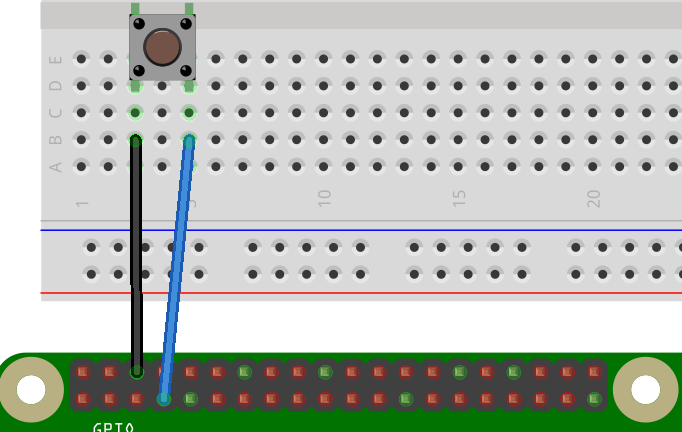
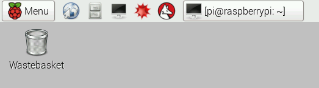
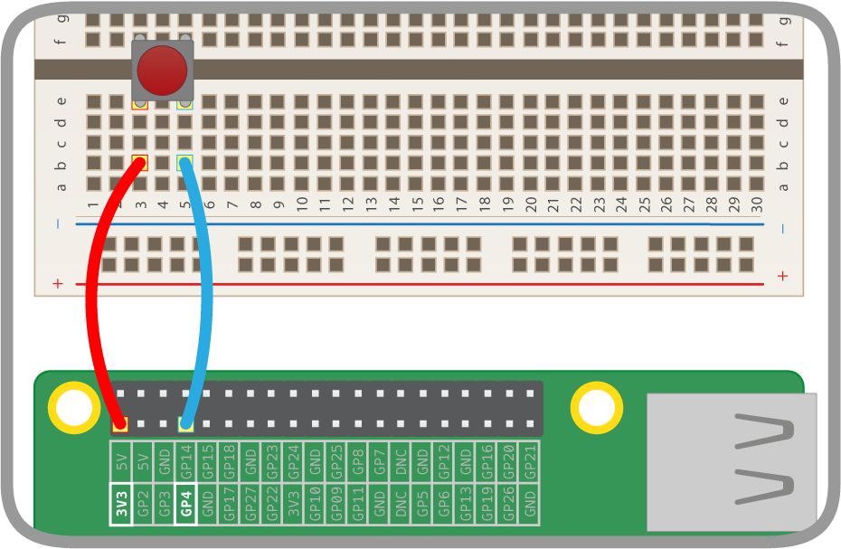

# Lesson 2 - Capturing input signals

In this lesson you will:

1. Create and execute a prorgam to get the current state of Pin 4 and display it on screen.
2. Use a while loop to repeat nthis **polling** of the pin and output the result.
3. Add a delay to slow down the rate of **polling**.
4. Adapt the program to use a pull down circuit.
4. Explore the timings of the loop to get the ideal sensitivity.

## Reading an input pin

First we need to be able to make sure we can read the input pin 4, we will start by build a **pull up** circuit.

Connect your wires / buttons as shown:



1. Open LX terminal from the menu bar
  
2. In LX terminal enter the command `nano pullup.py` and press Enter (nano is a text editor program).
3. Enter the code below.
  ```python
  #!/usr/bin/python3
  import RPi.GPIO as GPIO
  import time

  pin = 4

  GPIO.setmode(GPIO.BCM)
  GPIO.setup(pin, GPIO.IN, GPIO.PUD_UP)

  pin_value = GPIO.input(pin)
  if pin_value == True:
    print ("HIGH")
  else:
    print()"LOW")
  ```

  **Code explained:**

  ```python
  #!/usr/bin/python3
  ```

   This line denotes this file as a Python program so that the computer knows *how* to run the code.

  ```python
  import RPi.GPIO as GPIO
  import time
  ```

  Imports the `RPi.GPIO` library that allows you to control the GPIO pins and the time library to measure time or make the program sleep.

  ```python
  pin = 4
  GPIO.setmode(GPIO.BCM)
  GPIO.setup(pin, GPIO.IN, GPIO.PUD_UP)
  ```

   These 3 lines setup a variable call pin to store the pin number. We then set the scheme for referring to our pins as the BCM scheme. The important bit is the 3rd line where we setup the pin as an input using a pull up resistor

   ```python
   pin_value = GPIO.input(pin)
   ```
    This line reads the state of the pin and stores the result in a variable called **pin_value**. This will either be *True* or *False*.

    ```python
    if pin_value == True:
      print ("HIGH")
    else:
      print("LOW")
    ```
    These lines check the value of the **pin_value** variable and prints out `HIGH` if the value is **True** and `LOW` if the value is **False**.

3. Press `Ctrl - O` then Enter to save, followed by `Ctrl - X` to quit from nano.
4. Next, mark the file as executable with the following command:
`chmod +x pullup.py`

5. Type `sudo ./pullup.py` to test your code to ensure that when the button is pressed you get the output `LOW` and otherwise `high`.

## Repeatedly polling the input pin.
Currently our code checks the pin status once and displays an appropriate output.

Next we are going to add a slight adaptation to make it check repeatedly or **poll** the pin.

1. Edit you code again, in LX terminal enter the command `nano pullup.py` and press Enter.

2. You want to make the code simply check the pin over and over again until we stop the program. To do this we will wrap the main 5 lines of our program in a while loop, we will also add a pause to the program so that it doesn't check too often.

3. Adapt your code so that it the last section looks like this (be careful to get the indentation correct):
  ```python
  GPIO.setup(pin, GPIO.IN, GPIO.PUD_UP)
  
    while True:           #This line tells the program to loop the following indented section
        pin_value = GPIO.input(pin)
        if pin_value == True:
          print ("HIGH")
        else:
          print("LOW")
        time.sleep(0.5)   #This line adds a 0.5 second pause between polls.
  ```
1. Press `Ctrl - O` then Enter to save, followed by `Ctrl - X` to quit from nano.
1. Enter `sudo ./pullup.py` to run your code.
1. The text `HIGH` should begin scrolling up the screen, when you hold the wires together (close the switch) for a few seconds you'll see the text `LOW` because you're shorting the pin to ground. Release the wires (open the switch) and it will return to `HIGH` because of the internal pull *up* resistor.

  ```
  HIGH
  HIGH
  HIGH
  HIGH
  LOW
  LOW
  LOW
  LOW
  HIGH
  HIGH
  HIGH
  HIGH
  ```
1. Press `Ctrl - C` to exit your program.

## Adjusting Polling time

Now that our code constantly polls the input pin for it's state we need to think about timing.

1. Can you press the button fast enough that the program misses it?

2. Experiment with the line `time.sleep(0.5)`, change the time so that it always detects you're input. Try different times, find the biggest pause that still detects the input.

## Pull down circuit

1. Remove the jumper cables from the Raspberry Pi GPIO pins and reattach them as shown in the diagram below. Take care to select the correct pins.

  

1. The code required to test the pull down circuit is almost identical to that for the pull up so to save time we will just make a copy of your file and change one thing. Enter the command below (this takes a copy of `pullup.py` and saves it as `pulldown.py`):

  `cp pullup.py pulldown.py`

1. Enter the command below to edit the new file:

  `nano pulldown.py`

1. There is one line in the program that needs updating to reflect the change from a **pull up** to a **pull down**, which line is it?

2. Update the program and press `Ctrl - O` then Enter to save, followed by `Ctrl - X` to quit from nano.

3. The file doesn't need to be marked as executable with `chmod` since this property was copied from the original file. You can go ahead and run your code now, remember to use `sudo`:

  `sudo ./pulldown.py`

4. The text `LOW` should begin scrolling up the screen, when you hold the wires together (close the switch) for a few seconds you'll see the text `HIGH` because you're shorting the pin to 3.3 volts. Release the wires (open the switch) and it will return to `LOW` because of the internal pull *down* resistor.

  ```
  LOW
  LOW
  LOW
  LOW
  HIGH
  HIGH
  HIGH
  HIGH
  LOW
  LOW
  LOW
  LOW
  ```
1. Press `Ctrl - C` to exit your program.

## What's next?
In this lesson we have made our program respond to a single button press using a **Pull Up** and **Pull Down** setup.

- Are either of these circuits better than the other, does it make a difference which one we want to use?
- In our code we used a button to print a simple statement, what else could you make it do? What do you want your button to do?
- Could you connect multiple buttons to your Raspberry Pi and detect the states of each? Could you count the number of button presses?
