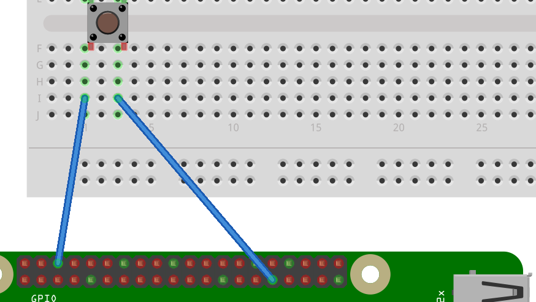

# Lesson 3 - The Rain Gauge

In this lesson you will:

- Simulate a rain gauge and collect data using the Raspberry Pi GPIO pins.
- Learn the difference between continuous polling and interrupt handling
- Convert the collected data into meaningful measurement information.

## How does the rain gauge work?

1. Today you will be using the rain gauge sensor to collect data about rainfall, the gauge consists of a bucket to collect water and a see-saw like device to count how much water passes through. Each time the bucket fills with a certain amount of water it tips, releasing the water and presents the opposite bucket to be filled.

  

2. Each tip causes a magnet to pass in front a sensor called a reed switch which closes the switch and triggers a `LOW` siganl on the GPIO pins. This is exactly the same as using a button or pair of wires as done in the previous lesson.

  

3. In order to calculate the amount of water that's passed through the gauge we need to know:
  - The amount of water needed to tip the bucket **0.2794** (can be found on the [datasheet](https://www.argentdata.com/files/80422_datasheet.pdf))
  - How many times the bucket has tipped which can be counted as the number of input signals.

  **Rainfall = 0.2794 * number of tips**

##What if I don't have a rain gauge?
In most classroom situations you won't have a rain gauge (or at least one to yourself), in that situation you can simulate one using a pair of wires and a button.

1. Connect your wires up in a similar way to the previous lesson  except this time connect to pin 27.
	
2. Now you can simulate a bucket tip with a simple press of the button.

## Counting bucket tips
1. You can reuse much of the code written last lesson to count the bucket tips, setup your Raspberry Pi and enter the following command from the terminal.

	```bash
cp pullup.py rain_polling.py
	```
2. Next edit the code with **nano**  by typing `nano rain_polling.py`.
3. In the top few lines change the pin being read to 27, the weather station is wired to use this pin so we should also use it for testing.

  ```python
  #!/usr/bin/python
  import RPi.GPIO as GPIO
  import time

  pin = 27

  GPIO.setmode(GPIO.BCM)
  GPIO.setup(pin, GPIO.IN, GPIO.PUD_UP)
    ```
3. We want to count the number of times the switch closes and drops the voltage from `HIGH` to `LOW`. In order to do this we need to keep track of the **current state** of the pin, the **previous state** and also the **count** of how many siganls there have been. To do this create 3 variables and set them each to 0.

	```python
	current_state = 0
	previous_state = 0
	count = 0
	```

4. We will still want a `while True:` loop to constantly check the pin status, but we want to do something extra with it.

	In pseudocode (planning) our loop might look like this:
	
	> LOOP
    	
    	SET **CURRENT STATE** TO THE READING OF **INPUT PIN**
    	
    	IF **PREVIOUS STATE** = 1 AND THE **CURRENT STATE** = 0 THEN
    	
    	--- ADD 1 ONTO **COUNT**
    	
    	--- DISPLAY **RAINFALL**
    	
    	MOVE THE **CURRENT STATE** TO **PREVIOUS STATE**
    	
    	PAUSE 0.01 SECONDS
    	
    	END LOOP

	In Python we would write
		
	```python
	while True:
	       current_state = GPIO.input(pin)

	        if previous_state == GPIO.HIGH and current_state == GPIO.LOW:
	            count=count + 1
	            print (count * 0.2794)

			previous_state = current_state
	```
5. Once you have entered your code you can save by pressing `CTRL + o` then `enter`, and then exit with `CTRL + x`.
6. Ensure your code is executable by typing `chmod 755 rain_polling.py`.
7. Run your code with the command `sudo ./rain_polling.py`. If you press your button a few times, it should look something like this:
     ```
     pi@raspberrypi ~/weather_station $ sudo ./rain_polling.py 
0.2794
0.5588
	```
	8. You can quit at any time with the keystroke `CTRL + c`, if your code doesn't work review the steps and the complete `rain_polling.py` code [here](code/rain_polling.py).

##Using interrupts in place of polling
So far we have used polling to repeatedly check the status of the input pin, something which is very inefficient. The code constantly checks for rainfall every 0.01 seconds, which uses some processing power. Wouldn't it be better if the system only checked for rainfall when it was raining and ignored the rain gauge the rest of the time?

To do that we need use a technique called interrupt handling. Rather than constantly check the status of the pin, we use a signal (interrupt) to trigger a function.

1. Copy your existing code to a new file called `rain_interrupt.py`

	```bash
	cp rain_polling.py rain_interupt.py
	```
2. Open the code in nano to edit

	```bash
	nano rain_interrupt.py
	```

3. The code to increment the count and display the current rainfall need to be moved into a function. You should also remove the variables **current_state** and **previous_state** as we won't need them. You should call the function something sensible and you will need this function name for the next step.

```python
#!/usr/bin/python3
import RPi.GPIO as GPIO

pin = 27
count = 0

def bucket_tipped(channel):
    global count
    count = count + 1
    print (count * 0.2794)

GPIO.setmode(GPIO.BCM)
GPIO.setup(pin, GPIO.IN, GPIO.PUD_UP)

```

4. In order to get your function to be triggered when the input voltage on pin 27 drops, you will need to define an interrupt event. Add this line to your code:

```python
GPIO.add_event_detect(pin, GPIO.FALLING, callback=bucket_tipped, bouncetime=300)
```

This line sets up the interrupt event on the `pin` and waits for a `GPIO.FALLING` event. When detected it calls the `bucket_tipped` function. The `bouncetime=300` parameter specifies the minimum time (milliseconds) between two event being detected.

5. Finally we need a line to keep the program running, otherwise it will finish before any rain is detected. For now we'll get it to wait for the user to press enter, and then exit.

```python
input("Press Enter to stop logging\n")
```

6. Save your code by pressing `CTRL + o` and `Enter`, then exit with `CTRL + x`.
7. From the terminal you should now be able to run your program by typing `sudo ./rain_interrupt.py`, the output should look something like this:

```bash
pi@raspberrypi ~/weather_station $ sudo ./rain_interrupt.py
Press Enter to stop logging
0.2794
0.5588
0.8382
1.1176
```

8. If your code doesn't work, check it against the full version [here](code/rain_interrupt.py).

9. You should now have a working rain gauge using 2 diiferent approaches:

	- What is the differeence between polling and interrupt handling?
	- Is one of these techniques better? If so why?
	- Why is the unit of measurement for the gauge **mm** rather than **ml**?

## What's next
- Now that you have built your rain gauge code you should test it's accuracy, how much water would 1mm be in the top of the bucket?
