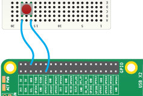

# Lesson 4 - Measuring wind speed

In this lesson you will:

- Simulate an anemometer and collect data using the Raspberry Pi GPIO pins.
- Use interrupt handling to detect inputs from the sensor.
- Use simple circle theory to convert the collected data into meaningful measurement information.

## How does the anemometer work?

1. Today you will be using the annemometer sensor to collect data about windspeed, the sensor has three arms with buckets on the end which "catch" the wind causing the arms to spin. If you were to dismantle the sensor you would find a small magnet attached the the underside.


A two points within the magnet's rotation it triggers a reed switch which produces a `LOW` signal, which we can detect. So for each full rotation of the arms the sensor will produce 2 detectable signals.


So, lets start collecting data from the sensor!

## Setup your Pi
1. If you have your own weather station addon board, simple connect it to the Pi and plug the anemometer into the socket marked `WIND`.

2. In the more likely scenario that you don't have an add on board you can wire up a button to simulate the signals created by the anemometer.



## Detecting interrupts
Before we begin calculating windspeed we need to be able to count the signals coming from the anemometer. To do this we can reuse some of our code from last lesson.

1. Open a terminal window and copy your rain gauge code:

```bash
cp rain_interrupt.py wind_interrupt.py
```

2. Edit the new code using nano:
```bash
nano wind_interrupt.py
```

3. The anemometer is connected to pin **5** update the code to reflect this

4. Rename the `bucket_tipped` function to something meaningful like `spin`. *This will need doing in 2 places*

5. The anemometer doesn't require a bouncetime to be set remove the option from the event declaration. delete the bit that says `,bouncetime=300`

6. Change the print statement to just print out the `count` variable.

7. Test your code! Save and exit nano `Ctrl + O` followed by `Ctrl + X` then run with :
```bash
sudo ./wind_interrupt.py
```
Your code should display the number of half rotations counted. Press `Ctrl + C` to stop the program. If it doesn't work as expected check your code against this [solution](wind_interrupt.py)

We can now count the signals from the anemometer, next we need to calculate the wind speed.

## Calculating wind speed
We can count the number of rotations of the sensor by doubling the detected inputs. But how do we change that into a speed?

1. Let's start by considering the formula for calculating [speed](http://www.bbc.co.uk/education/guides/zwwmxnb/revision):

  ###Speed = distance / time

  Imagine we counted the number of signals over the course of 5 seconds, now have the time but need the distance travelled.

2. The distance travelled by one of the cups will be equal to the number of revolutions * distance around the edge of the circle (Circumference). So we could write:

  ### Speed = Revolutions * Circumference / Time

3. The circumferce can be calculated if we know either the **Radius** or **Diameter** of the circle.


  We can measure the radius of the circle made by the anemometer by measuring the distance from the centre to the edge. Knowing the Radius we can find the circumference with **2 x pi x r**. We also know that the Revolutions are half the number of signals detected, so our formula becomes:

  ### Speed = (Signals/2) * (2 * pi * r) / Time

  This formula should enable us to calulate the speed of the wind in cm/s.

## Updating the Code
Now that we are able to calculate the wind speed from the information we can collect we need to add the code to make this work.

1. Measure the radius(cm) of the anemometer for use in you program .
2. Decide on the time interval for calculating average windspeed, at least 5 seconds.
3. Copy your existing code and edit the copy:
```bash
cp wind_interrupt.py wind_calc.py
nano wind_calc.py
```

4. Adapt your code using to following solution as a guide:

> import GPIO,time,math  
> pin 5  
> count = 0  
>
> FUNCTION spin (channel)  
> --- increment global count variable  
> --- display count  
>
> FUNCTION calcspeed  
> --- using r = **???**, your time interval, count and math.pi  
> --- calulate windspeed  
> --- return windspeed  
>
> Setup GPIO and interrupt which has spin as it’s callback function.  
>
> LOOP  
> --- reset global count to 0  
> --- wait **delay** sec  
> --- call calcspeed to get value  
> --- display windspeed value  

- The first 3 lines setup the different variables and required libraries.
- The **spin** function is called every time an interrupt is detected and adds 1 to the count variable and prints it.
- The **calcspeed** function uses all the right inforation to calculate the wind speed and returns it.
- The next line sets up the GPIO callback function for pin 5 and sets the function to spin.
- The final loop is set to wait for a time period before calulating the speed, printing it and then starting again.

Can you convert this program plan to a working python program.

## Measurement units

Currently the program we have created will measure the wind speed in **cm** per **second**, however this is not particularly useful. A more practical unit would be **km** per **hour**. In order to convert our units we will need to:

1. Convert cm -> km by **dividing** by the number of cm in 1km
2. Convert seconds -> hours by **multiplying** by the number of seconds in 1 hour.

Adapt your code so that it displays the windspeed in km/h.

## Calibration
Our program should now disply the wind speed in km/h, but is it accurate? The [datasheet](https://www.argentdata.com/files/80422_datasheet.pdf) says that if it rotates once a second that should equate to 2.4.. km/h. So in the example interval of 5 seconds, 5 spins (10 signals) should equal te same 2.4.. km/h.

1. Run your program spin the anemometer 5 times within the first 5 seconds, what wind speed value is reported?
  ```bash
  1
  2
  3
  4
  5
  6
  7
  8
  9
  10
  2.03575203953 kph
  ```

  That's not quite right! This loss of accuracy is due to something called the *anemometer factor* and is a result of some of the wind energy being lost in turning the arms. To compensate for this we are going to have to multiply the reading generated by our program by a factor of **1.18** which should correct for this error.

2. Re run the code and this time you should get a value closer to 2.4..

  ```
1
2
3
4
5
6
7
8
9
10
2.40218740664 kph
```

## What's next?
Now that you have a working anemometer program there are some other things you could do.
- Test your anemometer with a wind source such as a fan to ensure it works consistently.
- This device measures wind speed, what kind of location would be most suitable for this device? What factors should be considered, height, isolation, proximity to buildings? Where in your school or site would be the best place for it?
- In this lesson we have used interrupts to manage the data coming from the sensor, can you write a program that uses continuous polling?
