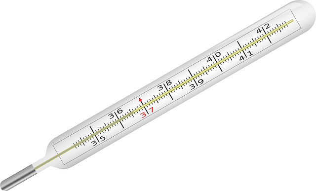
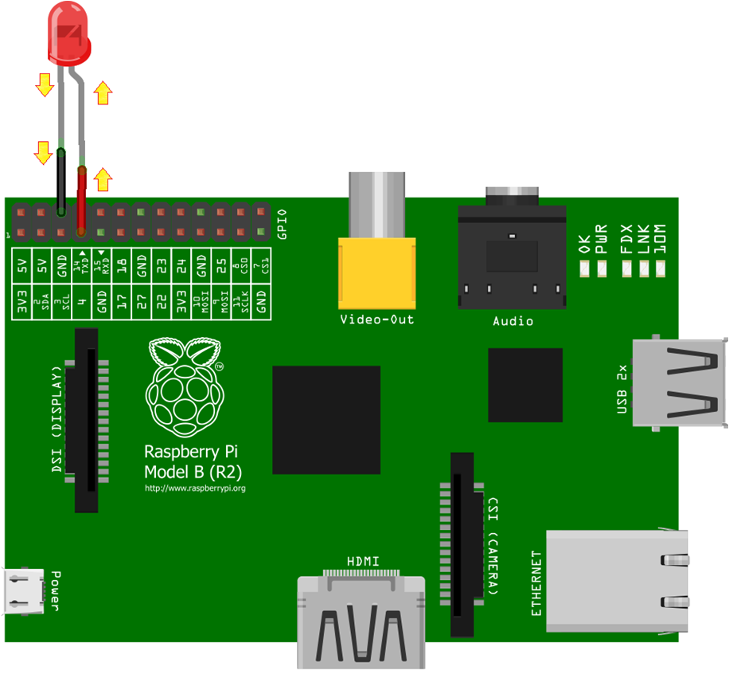
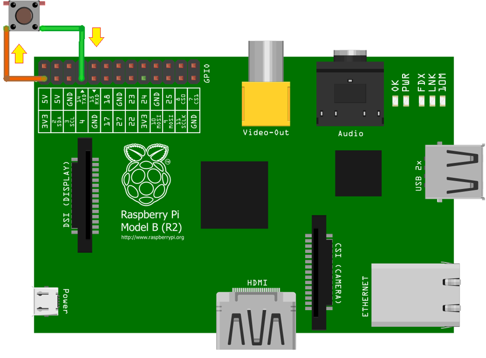

# Lesson 1: General orientation

## Introduction

This lesson will introduce the concept of a weather station and why we need one to build one. It serves as a general introduction to the scheme of work and will orientate the students to give them a general overview of the goals they will work towards. It will also introduce the theory behind using a general purpose interface to connect measurement devices to a Raspberry Pi.

## Learning Objectives

- Appreciate the need for an automated weather station
- Understand the weather characteristics that we can measure
- Understand the potential uses for the Raspberry Pi GPIO interface
- Differentiate between the input mode and output mode of the GPIO interface
- Understand the meaning of HIGH and LOW

## Starter

Predictions about future weather can have no credibility unless they are based on the analysis of scientifically gathered measurements. So what can we measure and how can we do it scientifically?

Firstly consider the characteristics of weather that we might want to predict in a forecast. These might include:

Characteristic | Meaning
--- | --- 
Temperature  | The measurement of hot and cold
Air pressure | The force per unit of area exerted by the air
Air quality | How contaminated the air is
Humidity | The amount of water vapor in the air
Rainfall | A depth per unit area of rain
Wind direction | The direction *from* which wind is blowing
Wind speed | The force exerted by the wind

Next consider what equipment we will need to measure each of these things. A nice class activity here is to ask everyone to name a device that they have seen or used that can measure one or more of the above weather characteristics. See how many they can name? This is a great opportunity to use some props if available.

Here is the full list of instruments:

Characteristic | Measurement device
--- | --- 
Temperature | Thermometer
Air pressure | Barometer
Air quality | Specialised sensor
Humidity | Hygrometer
Rainfall | Rain gauge
Wind direction | Weather vane
Wind speed | Anemometer

Next ask the class to think about how they would record data from these instruments. We're going to need a lot of data. *Lots*. Ideally we need to monitor all of these characteristics as they change over a long period of time so that trends and patterns can be sought.

The answer is that with most of those instruments you would need to visually *look* at them and then write down the measurement. Ask the class what else we might want to record in the interests of being scientific.

Measurement | Reason
--- | --- 
Date and Time | Ties the measurement to a specific time allowing for comparison to other measurements taken at earlier or later times
Location | Ties the measurement to a specific place allowing for comparison to other measurements taken at different locations and for plotting on a map

So how are we going to gather all this data? Let's suppose we want to take a reading from each of the instruments once every five minutes. Ask the class if there are any volunteers to sit outside in a shed day and night writing down numbers from those instruments?

The problem is that people need rest and there is also the issue of human error. Even if people were to work in shifts there is the possibility that mistakes will be made when writing down the measurements. What we need is some kind of automatic machine that doesn't need sleep. We need a *computer!*

We could easily program a computer to take the measurements every five minutes. We can then just leave it unattended and it will happily continue to record measurements until the end of time.

But how are we going to connect the sensors to it? The answer is we need a computer that has a general purpose interface.

*The Raspberry Pi model B (left) and the B+ (right)*

The [Raspberry Pi](http://www.raspberrypi.org/help/what-is-a-raspberry-pi/) is a tiny, inexpensive, computer that's roughly the same size as a credit card. It comes as a bare circuit board with no case although many third party cases are available. It's a full standalone PC that works independently, can be connected to any TV or Monitor and uses standard USB peripherals.

What makes this computer different to the ones you may be used before is the row of pins, sticking up, in the corner.

Those are called General Purpose Input Output pins or *GPIO* for short. These allow the Raspberry Pi to interface with a vast array of electronics and physical objects such as lights, buzzers, motors, robotic arms, servos, relays and sensors. 

So we can use the Raspberry Pi GPIO pins to connect our weather sensors. The students might be wondering how we could connect something like a surgical thermometer to the GPIO pins at this point. The answer is that we wouldn't use the traditional instruments mentioned above but rather versions of them that have been specifically designed for computer control. Each of the following lessons introduces a new, computer interfaceable, sensor and explains how to program the Raspberry Pi to talk to it. Students will build up a library of code that will eventually be used in the finished weather station deployed outside.

## Main Development

Let's put weather measurement to one side for a while so we can gain an understanding of the technology we're going to use. The main part of this lesson will be an introduction to the GPIO pins and what they can do. This will form a foundation upon which the other lessons will build. The Raspberry Pi GPIO pins are controlled through *code*. Specifically, in these lessons, the [Python](https://www.python.org/about) programming language will be used.

Each individual pin can be set up in two main modes: *Input* mode and *Output* mode.

### Output mode

Output mode is used when you want to supply power to a device like an LED or buzzer. The picture below shows how a single LED would be connected. Notice the grid of numbers below the GPIO pins, that shows what each pin is for. Don't try to understand the numbering system, just consider it arbitrary for now. 

The red wire is being used to connect GPIO 4 to the positive leg of the LED. The black wire connects the negative leg of the LED to GND (ground) to complete the circuit. The LED will not light up though unless we give the Python command to make GPIO 4 output power. We'll look into these commands later but we could, for instance, issue the commands in such a way that the LED flashes on and off at a certain speed. The point to understand is that we have *control* of the LED turning on and off in our code.

### Input mode

If we use *input* mode, a GPIO pin has a value that we can read in our code. If the pin has voltage going into it, the reading will be `1` HIGH; if the pin was connected directly to ground (no voltage), the reading will be `0` LOW. The picture below shows how a push button would be connected. In our code we want to know if the button has been pressed or not. To do this we can use a clever trick to loop back some power from the Raspberry Pi, through the button and into a GPIO pin that is using input mode.

The orange wire is being used to connect one side of the button to the 3.3 volt supply of the Raspberry Pi (a pin that always outputs 3.3 volts by default). The green wire connects the other side of the button to GPIO 4. The button works like a switch, so while it's up (open switch) no voltage will reach GPIO 4 so the reading will be `0` LOW. When the button is pressed (closed switch) voltage will flow into GPIO 4 whereup on the reading will be `1` HIGH.

In our code we would then use a loop to repeatedly check the GPIO 4 reading. When it changes from LOW to HIGH we have detected the button press and can show a message or take any action that we want. The point to remember is that a pin can be made to use *either* input mode or output mode but not both at the same time. Note that the above examples both used GPIO 4.

## Plenary

Just to recap let's reiterate the meaning of HIGH and LOW. These are the two states a GPIO pin can have regardless of which mode it is using. Take a look at the graph below, this shows the voltage of GPIO 4 on the *y* axis and time on the *x* axis:

Ask the class the following questions:

1. What would be happening if this graph was from the Output mode LED example?
1. What would be happening if this graph was from the Input mode button example?

*Answers:*

1. The LED is flashing on and off three times.
1. Someone is pressing and releasing the button three times.

[Next lesson](../lesson2/README.md)
