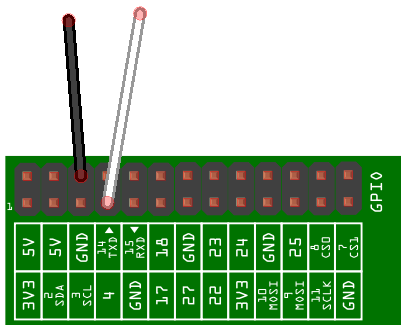
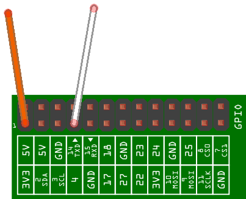

[Previous lesson](../lesson1/README.md)

# Lesson 2: Using GPIO input mode

## Introduction

In this lesson students will experiment with the Raspberry Pi GPIO and do some Python programming. We are going to focus on input mode specifically since this is more appropriate to sensing things from the outside world than output mode. This knowledge will be used to interface with the rain gauge and wind speed sensors in later lessons.

## Resources

Students should work in pairs and will each pair need the following equipment:

- Raspberry Pi
- Micro USB power adaptor
- An SD Card with Raspbian already set up through NOOBS
- USB keyboard
- USB mouse
- HDMI cable
- A monitor or TV
- Two **Male to Female** jumper wires (try [Pimoroni](http://shop.pimoroni.com/products/jumper-jerky))

## Learning Objectives

- Understand what a pull up circuit is, what a pull down circuit is and be able to differentiate the two
- Understand how to detect the position of a switch in the Python programming language
- To gain practical experience in programming and electronics

## Starter

In this lesson we are going to make a very basic switch and program the Raspberry Pi to detect its position. The switch will actually just be two jumper wires that you touch together, see below. If they are touching the switch is closed, if not the switch is open.


In the previous lesson we learnt about HIGH and LOW. In order to detect the open and closed position in code the switch must turn voltage on and off for a GPIO pin. Then, using input mode, we can detect a change in the pin's value in our code.

When a GPIO pin is in input mode the pin is said to be *floating*, meaning that it has no fixed voltage level. That's no good for what we want, as the pin will randomly float between HIGH and LOW. We need to categorically know that the wires have touched. So we need to fix the voltage level to HIGH or LOW, and then make it change *only* when the we touch the wires together.

We can do this in two ways:

- A pull up circuit

  Wire the GPIO pin to 3.3 volts through a large 10kΩ resistor so that it always reads HIGH. Then we can short the pin to ground by touching the wires together so that the pin will go LOW.

  

- A pull down circuit

  Wire the GPIO pin to ground through a large 10kΩ resistor so that it always reads LOW. Then we can short the pin to 3.3 volts by touching the wires together so that it goes HIGH. When the wires touch there is a lower resistance path to 3.3 volts, and therefore the pin will read HIGH. 

  
  
  *Note: The 1kΩ R2 resistor is there in both circuits to give the GPIO pin a fail-safe protection, in case we mistakenly set the pin to be in OUTPUT mode.*

Fortunately, the Raspberry Pi has all the above circuitry built in. It can be helpful to imagine that the two resistors `R1` and `R2` from the diagrams above are *inside* the circuitry of the Raspberry Pi and they can be enabled or disabled as we desire. We can select either a pull up or a pull down *in our code* for each GPIO pin. 

Let's give it a try in practice next.

## Main Development

We will test our switch in both pull up and pull down circuit configurations.

### Setting up your Pi

1. Place the SD card into the slot of your Raspberry Pi.
1. Next connect the HDMI cable from the monitor or TV.
1. Plug in the USB keyboard and mouse.
1. Plug in the micro USB power supply.
1. When prompted to login type:

    ```bash
    Login: pi
    Password: raspberry
    ```

### Pull up circuit

Here we are going to use the internal pull up resistor to make GPIO 4 always read HIGH, then we will short it to ground through the wires so that it will read LOW when we touch the wires together.

*Note: The first 26 pins on a B+ are the same as those on a model A or B.*

1. Attach the female ends of the jumper wires to the Raspberry Pi GPIO pins as shown below. Take care to select the correct pins.

  

2. Go to the Linux command prompt, either Exit the desktop or open LX Terminal.
3. Enter the command `nano pullup.py` and press Enter (nano is a text editor program).
4. Enter the code below.
  ```python
  #!/usr/bin/python
  import RPi.GPIO as GPIO
  import time
  
  pin = 4
  
  GPIO.setmode(GPIO.BCM)
  GPIO.setup(pin, GPIO.IN, GPIO.PUD_UP)
  
  while True:
      pin_value = GPIO.input(pin)
      print "HIGH" if pin_value else "LOW"
      time.sleep(0.5)
  ```
  **Code walkthrough:**
  
  | Code | Meaning |
  | --- | --- |
  |`#!/usr/bin/python` | This line denotes this file as a Python program so that the computer knows *how* to run the code. All of your Python programs will have this.|
  |`import RPi.GPIO as GPIO` |  Imports the `RPi.GPIO` library that allows you to control the GPIO pins.|
  |`import time` | Imports the `time` library that allows you to measure time or make the program sleep.|
  |`pin = 4` | A variable called `pin` to store the number 4. This will be used whenever you need to refer to the GPIO pin number that you're switching voltage on and off for later on in the program.|
  |`GPIO.setmode(GPIO.BCM)` | Wherever you see the syntax `SOMETHING.` the *dot* signifies accessing a function or properly inside the thing before the dot. So `GPIO.setmode` is going inside the `GPIO` library and calling the function `setmode`. This configures the pin layout that you want to use. The brackets `()` are important because they enclose the function *parameters;* the input data that the funciton needs. You can input either `GPIO.BCM` or `GPIO.BOARD` to this function. We're going to use `GPIO.BCM` here since this layout matches the diagrams that are part of this lesson. `GPIO.BOARD` sets the pin numbers up in a sequential fashion and some programmers prefer it that way. If you prefer to use `GPIO.BOARD` then the `pin` variable should be changed from 4 to 7.|
  |`GPIO.setup(pin, GPIO.IN, GPIO.PUD_UP)` | This configures the IO (input/output) mode for a given GPIO pin. When you want to input multiple parameters to a function you separate them with a comma `,`. There are three parameters; `pin` which specifies the number of the GPIO pin to configure; `GPIO.IN` specifies that we want to use input mode and `GPIO.PUD_UP` is saying we want to turn on the internal pull up resistor so that the pin always reads HIGH.|
  |*Note:*|Now everything is set up and we can start reading the pin value. To keep it simple the program will just use a loop to repeat the same set of instructions. Those instructions will read the value of GPIO 4 and display it on the screen allowing you to see the pin value changing in real time. We're going to use a *while* loop. A while loop is usually used with a condition such as `while a < b` (while a is less than b) meaning that the looping will carry on as long as that condition remains true. So if *a* becomes equal to or greater than *b* the loop would exit.|
  |`while True:`| The `while True` syntax specifies an infinite loop. The keyword `True` is a *constant* (not a variable) and so the loop will never exit unless we press `Ctrl - C`. It's not the most elegant way to program it but this is just test code after all.|
  |*Note:*|Whenever you see a colon `:` think of this as meaning *then*. So `while True:` *while true is true then repeat these lines of code*. The subsequent lines are indented to denote that they all belong to the loop. You can either use multiple space characters or a tab character for indentation. If you prefer to use spaces then the number of spaces in the indentation can be variable, as long as they remain constant in each block of code. **Understanding the rules of indentation is fundamental to Python; it can be a stumbling block for students.** Students often do not understand what white space is; they therefore need to be shown that spaces and tabs are real text characters which are normally invisible in text editors.|
  |`pin_value = GPIO.input(pin)`| This is defining a variable called `pin_value` and setting it to the result of the `GPIO.input` function. This will go and get the value of the specified GPIO pin number (based on the voltage going into it) so we pass the variable `pin` in as a parameter. The result value will be either `1` if HIGH or `0` if LOW.|
  |`print "HIGH" if pin_value else "LOW"`| This line uses a `print` statement with an in-line `if` statement. It will print the text HIGH if `pin_value` is `1` otherwise it will print LOW.|
  |`time.sleep(0.5)`| This line uses a function inside the `time` library called `sleep`, the function accepts only one parameter which is how long you want it to sleep for. Here we specify half a second. This essentially pauses the execution of the code for half a second on each iteration of the loop.|
  
5. Press `Ctrl - O` then Enter to save, followed by `Ctrl - X` to quit from nano.
6. Next, mark the file as executable with the following command:

  `chmod +x pullup.py`
7. GPIO functions require root access on your Pi, so you must use the `sudo` command to run your code. If you don't use sudo you'll see the following error: `No access to dev/mem. Try running as root!`

  `sudo ./pullup.py`
8. The text `HIGH` should begin scrolling up the screen, when you hold the wires together (close the switch) for a few seconds you'll see the text `LOW` because you're shorting the pin to ground. Release the wires (open the switch) and it will return to `HIGH` because of the internal pull *up* resistor.

  ```
  HIGH
  HIGH
  HIGH
  HIGH
  LOW
  LOW
  LOW
  LOW
  HIGH
  HIGH
  HIGH
  HIGH
  ```
9. Press `Ctrl - C` to exit your program.

### Pull down circuit

1. Remove the jumper cables from the Raspberry Pi GPIO pins and reattach them as shown in the diagram below. Take care to select the correct pins.

  

2. The code required to test the pull down circuit is almost identical to that for the pull up so to save time we will just make a copy of your file and change one thing. Enter the command below (this takes a copy of `pullup.py` and saves it as `pulldown.py`):

  `cp pullup.py pulldown.py`

3. Enter the command below to edit the new file:

  `nano pulldown.py`

4. Find the `GPIO.setup` line and change the last parameter from `GPIO.PUD_UP` to `GPIO.PUD_DOWN`. This sets the internal pull down resistor on GPIO 4 so that it will always read LOW. For example:

  `GPIO.setup(pin, GPIO.IN, GPIO.PUD_DOWN)`

5. Press `Ctrl - O` then Enter to save, followed by `Ctrl - X` to quit from nano.
6. The file doesn't need to be marked as executable with `chmod` since this property was copied from the original file. You can go ahead and run your code now, remember to use `sudo`:

  `sudo ./pulldown.py`
7. The text `LOW` should begin scrolling up the screen, when you hold the wires together (close the switch) for a few seconds you'll see the text `HIGH` because you're shorting the pin to 3.3 volts. Release the wires (open the switch) and it will return to `LOW` because of the internal pull *down* resistor.

  ```
  LOW
  LOW
  LOW
  LOW
  HIGH
  HIGH
  HIGH
  HIGH
  LOW
  LOW
  LOW
  LOW
  ```
8. Press `Ctrl - C` to exit your program.

## Plenary

Show this table to the class to recap. It is important to recognise that the pull up and pull down circuits give opposite values when the switch is open and closed. It can help if you first cover up the pull down column, and then cover up the pull up column instead.

Pull up | Switch | Pull down
:---:|:---:|:---:
HIGH | Open | LOW
HIGH | Open | LOW
HIGH | Open | LOW
HIGH | Open | LOW
LOW | Closed | HIGH
LOW | Closed | HIGH
LOW | Closed | HIGH
LOW | Closed | HIGH 
HIGH | Open | LOW
HIGH | Open | LOW 
HIGH | Open | LOW
HIGH | Open | LOW

Ask the class the following questions.

1. Explain why the pull up shows those values.
1. Explain why the pull down shows those values.
1. Is one circuit better than the other? If so why?
1. We've learnt an important technique in this lesson which will allow us to interface with two of the weather station sensors. Which sensors we will use this for?

**Answers:**

1. With a pull up circuit the GPIO pin is internally pulled up to 3.3 volts (via a programmable resistor) so that it always reads HIGH. When we close the switch we short the GPIO pin to ground causing it to read LOW.
1. With a pull down circuit the GPIO pin is internally pulled down to ground (via a programmable resistor) so that it always reads LOW. When we close the switch we short the GPIO pin to 3.3 volts causing it to read HIGH.
1. Neither is better, they are both an equally valid way to detect a switch or push button.
1.  The rain guage and the anemometer (wind speed sensor).

[Next lesson](../lesson3/README.md)
