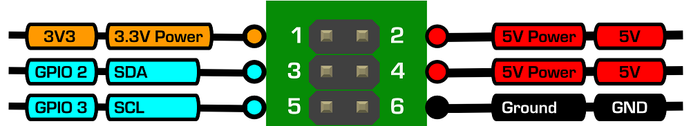

[Previous lesson](../lesson4/README.md)

# Lesson 5: The wind vane


## Introduction

In this lesson students will use the weather station expansion board and the wind vane. Students will firstly learn how the wind vane works and understand the differences between analogue and digital signals. Python code will be written to convert the analogue signal from the wind vane to a digital number using an ADC (Analogue to Digital Converter). This number will then be used to determine the direction the wind vane is pointing.

## Resources

Students should work in pairs. Each pair will require the following equipment:

- Raspberry Pi
- Weather Station Expansion Board
- Wind vane
- Micro USB power adaptor
- An SD Card with Raspbian already set up through NOOBS
- USB keyboard
- USB mouse
- HDMI cable
- A monitor or TV
- A small phillips screwdriver (magnetic if possible)

## Learning Objectives

- Understand how the wind vane works
- Be able to differentiate between analogue and digital signals
- Understand the purpose of an Analogue to Digital Converter
- Understand digital communication using the I²C protocol
- Determine the direction of the wind vane

## Starter

A wind vane shows the direction *from which* the wind is coming, not where it's going (this can be confusing because TV weather maps show the opposite). It works by the wind exerting force on a vertical blade which rotates to find the position of least resistance, this position is then aligned with the direction of the oncoming wind.

Also known as a weather vane these are often found as decorative adornments at the highest point on buildings or churches. Typically taking the shape of a cockerel, horse or ship.

### How it works

The wind vane is the most complex of the sensors studied so far. It does use reed switches and magnets but it works in a completely different way. Ask the students to pull the top off their wind vane, it should come off without much force. On the underside you'll again find the metal cylinder which is the magnet.


*Note: Disassembling the next part is only recommended for students with good motor skills. Younger students may have difficulty reassembling it.*

Next take the screwdriver and remove the three screws in the base, slide the base panel down the cable a bit to get it out of the way. If you look inside now you'll see there are eight reed switches arranged like the spokes of a wheel. Remove the three remaining screws allowing the circuit board to come free. Do not lose these screws.


Examine the green side of the circuit board now, this is the side that faces upward inside the wind vane. The magnet points down onto it. North is at the top in the picture above, where the two black clips for the anemometer socket are.

Look closely and you'll see there is a ring of metal that goes all the way around the edge. There is also a smaller ring in the centre. Each reed switch connects to the outer ring to the inner ring through a resistor. You'll see that `SW1` (switch 1) has `R1` near it (resistor 1), similarly `SW2` has `R2` and so on up to 8.

So what is going on here? Firstly students need to understand what a [resistor](http://en.wikipedia.org/wiki/Resistor) is. These are small components that resist/reduce the flow of electrical current but do not stop it, at the same time they also reduce the voltage moving through the circuit. Resistors can have different values, a low resistance value would let almost all voltage/current through but a high resistance value would let very little through.

The wind vane is working like a big variable resistor, think of a volume knob. Look at the schematic diagram below (a zigzag line is the symbol for a resistor). The idea is that voltage comes in on the outer ring and can take a path through any of the switches to the inner ring which is connected directly to ground. As the magnet rotates different reed switches will open and close and thus switch their corresponding resistor in and out of the circuit.


Each of the 8 resistors have different values which you'll see printed in white text next to them, this then allows the wind vane to have 16 possible combinations of resistance since the magnet is able to close two reed switches when half way between them.

Reassemble the wind vane now. Firstly locate the letter N on the side of the base, insert the circuit board with the green side facing away from you so that the anemometer socket aligns with North. Replace the three smaller screws (this step can be tricky and a magnetic screwdriver helps a lot). Next replace the base ensuring the knot in the cable remains inside. Finally replace the three larger screws.

### How can we measure it?

So we now understand that the wind vane is essentially a variable resistor similar to a volume knob (but with only 16 positions). Resistance is something that we can't measure directly because it's a passive property of the wind vane. What we need to do is measure something that changes as a *consequence* of the resistance. Namely the *voltage* going through the wind vane. The voltage level passing through it will go up and down as different resistors are switched on and off by the magnet. That, we *can* measure.

This is going to be entirely different to what we have done before. With the rain gauge and the anemometer we were working with voltage levels changing between 0 volts meaning *LOW* and 3.3 volts meaning *HIGH*. Our code could only tell us if a GPIO pin was HIGH or LOW but not somewhere in between. This is what is known as a *digital* signal, all or nothing, 1 or 0, HIGH or LOW. For the wind vane we need to accommodate a range between HIGH and LOW, this is known as an *analogue* signal.

### Analogue vs Digital

It is important for us to understand the general concept of analogue and digital. Think of a gaming control pad like the one below. The circle is highlighting the thumb joystick and the directional-pad. Ask the class which one is analogue and which one is digital?


**Answers:**

- Thumb joystick: Analogue
  
  The thumb joystick is analogue because it provides a full range of motion between each direction. In a driving game you have the option to steer gently around a long sweeping corner or hard around a hairpin for example.

- Directional-pad: Digital

  The directional-pad is digital because the each direction button has only two states, on and off. Just like HIGH and LOW. In a driving game it would be like steering a car using the indicator stick, you would have full left and full right only. It would be very tricky to control!

Analogue and digital both have their place and often one works better for a particular task than the other. For a game like a flight simulator you would want analogue control to aim the plane, whereas for something simple like a jump, run and shoot platform game digital control is better.

### Analogue to Digital Conversion

So to recap then. The wind vane has a voltage going through it and this will vary according to which resistors are switched in and out by the reed switches and magnet. The challenge we face is being able to observe this analogue signal changing on a computer which is basically a digital machine.


To do this we're going to use a clever microchip called an [Analogue to Digital Converter](http://en.wikipedia.org/wiki/Analog-to-digital_converter) or ADC for short. The weather expansion board has one of these built in (as do most games consoles). An ADC chip, like the one above, has a number of input pins. One of them is connected to the voltage going through the wind vane. We don't need to worry about the internal workings of the chip we just need to understand that it can convert from a continuous analogue voltage to a number (in code) that represents the voltage *magnitude*. More voltage will give a higher number, less voltage a lower one.

The *resolution* of an ADC chip describes the number of unique readings that it can produce to represent this magnitude. The resolution value is given in *bits* (a bit is a binary 1 or 0). A ten bit ADC, for example, can produce values between 0 and 1023 (`1111111111` in binary = `1023` in decimal).

The ADC we're using has 15 bits of resolution. So this can produce values between 0 and 32767 in our code. That's quite a lot of resolution! However the wind vane has only 16 possible combinations of resistance that each represent a compass direction (these are listed in the [datasheet](https://www.argentdata.com/files/80422_datasheet.pdf)). This gives us 16 possible voltage levels to convert with the ADC. In turn this gives us only 16 possible readings from the ADC that lie somewhere between 0 and 32767.

Below we will find out what those 16 numbers are and translate them into the corresponding compass direction in our code.

### How do we talk to the ADC chip?

There is one more layer that we need to reveal.

Generally speaking most computer chips communicate by sending and receiving binary data. In order to have successful two way communication there needs to be set of rules (like a language) that both chips obey. In computing terms this is known as a *protocol*. The ADC chip on the weather expansion board uses the [I²C protocol](http://en.wikipedia.org/wiki/I%C2%B2C) (pronounced I-squared-C) which stands for Inter-Integrated Circuit. Several other chips on the weather expansion board also use it, such as the pressure and humidity sensors (covered in separate lessons). We're not going to go into the finer details of I²C but it is important that we understand the general principle so that the code we write makes sense later on.


With I²C there is usually one *master* device and several *slaves* that are all connected through a pair of wires known as the I²C *bus* (as above). One wire is for transferring data and the other is used for a timing signal. Often referred to as `DATA` *(SDA)* and `CLOCK` *(SCL)* respectively. The I²C bus originates on the Raspberry Pi from the two GPIO pins shown below in blue. The weather expansion board then does the job of connecting the slave devices to it.



So the Raspberry Pi itself is the master and the slave devices are things like this ADC chip and various other sensor chips. The master is essentially in charge of all the slave devices and is responsible for starting and stopping all communications. The master can send data to a slave (write) or receive data back from one (read) but the slaves never communicate with each other directly. 

It's not just for sensors though. Most mobile phones use I²C extensively. It allows the phone to communicate with all the subsidiary devices such as the screen, touchpad, camera, microphone and speakers. Each device on the I²C bus has a unique *address* which is used by the master to differentiate slave devices during communication. We will need to put the I²C bus address of the ADC into our Python code later for example.

In practise the master will write a binary sequence to a slave at the intended address, the binary code usually instructs the slave to perform a task (such as take a measurement). The master then waits for a *tiny* amount of time for the slave to do the work whereupon a read command is sent. The slave then starts sending binary data back to the master and this will be the result of said task (such as the value of the measurement).

Below we will learn how to do this for the ADC chip. We will first understand the binary code for giving instructions to the ADC and then how to interpret the binary sent back. When we've got that far we can then start looking at converting the reading into a compass direction for the wind vane.

There is a lot to take in here. A lot of these techniques will be reused making future lessons easier so do not be discouraged!

## Main Development

Our general plan of action will be as follows:

1. Install and configure the software, then test it. 
1. Write code to talk to the ADC.
1. Use the ADC to measure the voltage level going through the wind vane.
1. Verify that these readings change as the wind vane rotates.
1. Record the ADC measurements for each of the 16 possible wind vane positions.
1. Construct a look up table to translate between the ADC value and the compass direction.
1. Write code to determine the direction of the wind vane.

### Setting up your Pi

1. Place the SD card into the slot of your Raspberry Pi.
1. Connect the Weather Expansion Board to the GPIO pins.
1. Connect the wind vane to the socket marked *WIND* on the Weather Expansion Board.
1. Next connect the HDMI cable from the monitor or TV.
1. Plug in the USB keyboard and mouse.
1. Plug in an Ethernet cable for Internet access.
1. Plug in the micro USB power supply.
1. When prompted to login type:

    ```bash
    Login: pi
    Password: raspberry
    ```

### Install, configure and test

*Note: This will only need to be done once. But in a class environment it can help if this step has been done prior to starting the lesson.*

1. Before we can start using any I²C devices on your Raspberry Pi we need to edit a few files, reboot and then install some software packages. Firstly the I²C kernel module needs to be un-blacklisted. Enter the following at the command line:

  `sudo nano /etc/modprobe.d/raspi-blacklist.conf`

1. Comment out the line `blacklist i2c-bcm2708` by putting a `#` symbol at the start of the line.
1. Press `Ctrl - O` then `Enter` to save, followed by `Ctrl - X` to quit from nano.
1. Next set the I²C kernel module to automatically load at boot time:

  `sudo nano /etc/modules`

1. Append `i2c-dev` on a new line at the end of the file.
1. Press `Ctrl - O` then `Enter` to save, followed by `Ctrl - X` to quit from nano.
1. Reboot:

  `sudo reboot`

1. Login again as per usual. Now update your local package repository:

  `sudo apt-get update`
  
  This may take a few minutes depending on Internet speed at your location.

1. Install the I²C tools package:

  `sudo apt-get install i2c-tools`

  This will also take a few moments.

1. Let's list all slave devices that are connected to the I²C bus, this is a really good way to test that the sensors are alive and working. Enter the command below:

  `sudo i2cdetect -y 1`
  
  If you're using an old Rev 1 Raspberry Pi (without mounting holes) you'll need to use `-y 0` in the above command.
  
  This cycles through all the possible addresses testing to see if anything responds for each one. The output should look something like this:
  ```
       0  1  2  3  4  5  6  7  8  9  a  b  c  d  e  f
  00:          -- -- -- -- -- -- -- -- -- -- -- -- -- 
  10: -- -- -- -- -- -- -- -- -- -- -- -- -- -- -- -- 
  20: -- -- -- -- -- -- -- -- -- -- -- -- -- -- -- -- 
  30: -- -- -- -- -- -- -- -- -- -- -- UU -- -- -- -- 
  40: 40 -- -- -- -- -- -- -- -- -- -- -- -- -- -- -- 
  50: -- -- -- -- -- -- -- -- -- -- -- -- -- -- -- -- 
  60: -- -- -- -- -- -- -- -- 68 69 -- -- -- -- -- -- 
  70: -- -- -- -- -- -- -- 77
  ```
  The list is showing all available bus addresses and where the slave devices are occupying them. The `--` means that the address is free. You'll also notice the list is in [hexadecimal](http://en.wikipedia.org/wiki/Hexadecimal), the columns go from 0 to f.
  
  These are the devices that are using the addresses:
  
  - 3b: UU means reserved (for an optional audio device)
  - 40: Humidity sensor
  - 68: Real time clock
  - 69: ADC
  - 77: Pressure sensor
  
  You may notice that 40 and 77 are not there. You will need to plug in the AIR board in order for those two to appear on the I²C bus. 68 and 69 are on the main weather expansion board though and you should expect to always see them. If you don't there may be an issue with the connection to the board, check it and try again.

### Write code to talk to the ADC

We're going to write code that will send an eight bit binary number, over the I²C bus, to the ADC. The number is basically a command. But what does this mean exactly? A bit is a binary 1 or 0. So *eight bit* just means a binary number that is eight digits long.

`11111111` for example is 255 in decimal.

There is a clever way to use binary numbers to encode information besides just representing a numeric value. It's called *bitwise encoding*. Think of a row of eight flags. Each flag has a particular meaning and it can either be *up* or *down* on the flagpole. This way you can encode eight different yes or no meanings into the row of flags.


As long as the flags stay in the right order and everyone knows the meaning of each flag it will work. The row of eight flags is analogous to an eight bit binary number, each binary bit encodes a yes or no (1 or 0) meaning to the I²C slave device.

| 1 | 2 | 3 | 4 | 5 | 6 | 7 | 8 |
| --- | --- | --- | --- | --- | --- | --- | --- |
| Ready bit | Channel selection bit 1 | Channel selection bit 2 | Conversion mode bit | Sample rate bit 1 | Sample rate bit 2 | Gain bit 1 | Gain bit 2 |

When we send the binary number to the ADC it saves it to its configuration register and then performs the task required. The meanings for each bit are summarised in the table above. More detail is given in the ADC [datasheet](http://ww1.microchip.com/downloads/en/DeviceDoc/22226a.pdf) under section 5.2 (page 18) if you want to see it.


## Plenary

[Next lesson](../lesson6/README.md)
