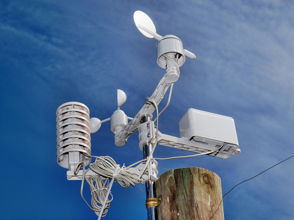

[Previous lesson](../lesson5/README.md)

# Lesson 6: Deploying the Weather Station

## Introduction

## Resources

Students should work in pairs. Each pair will require the following equipment (most of this will have been supplied as part of the weather station kit):

- Raspberry Pi
- Weather Station Expansion Board
- Rain guage
- Anemometer
- Wind vane
- AIR sensor board (with short 6 wire RJ11 cable)
- Ground temperature probe
- Long Ethernet Cable (long enough to reach from the school building to the chosen location)
- 24 volt UK Mains Power Supply
- Passive POE splitter and injector set
- 2 x IP65/66 electrical junction boxes
- Screws
- Rubber washers
- Silicone gel packet
- 5 x IP65/66 M20 cable glands
- An SD Card with Raspbian already set up through NOOBS
- USB keyboard
- USB mouse
- HDMI cable
- A monitor or TV

## Learning Objectives

## Starter

[Next lesson](../../display)
